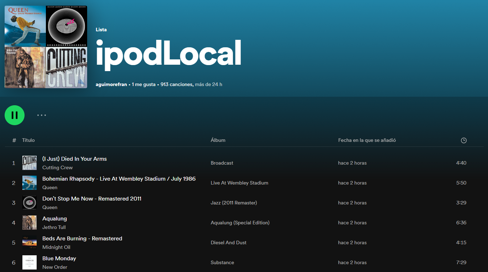
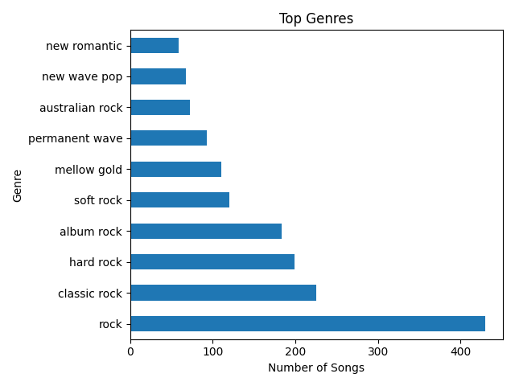
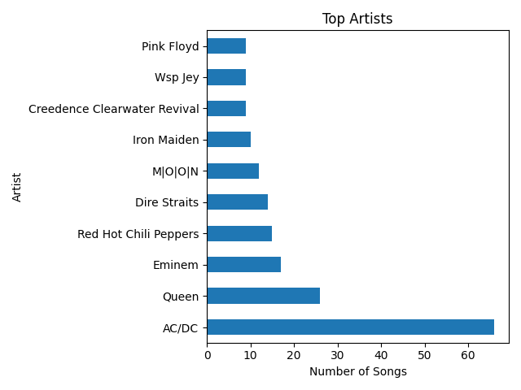

# iTunes library to Spotify

Convert your old iTunes library to a Spotify playlist.

Some simple charts are also generated.

## Run

1. Visit [Spotify for Developers](https://developer.spotify.com/dashboard/applications) and create a new application.
2. Get your client ID and client secret and fill the `.env` file.
3. Copy the path to your iTunes library path and run `python run <path>`.

## Results

  

  

  